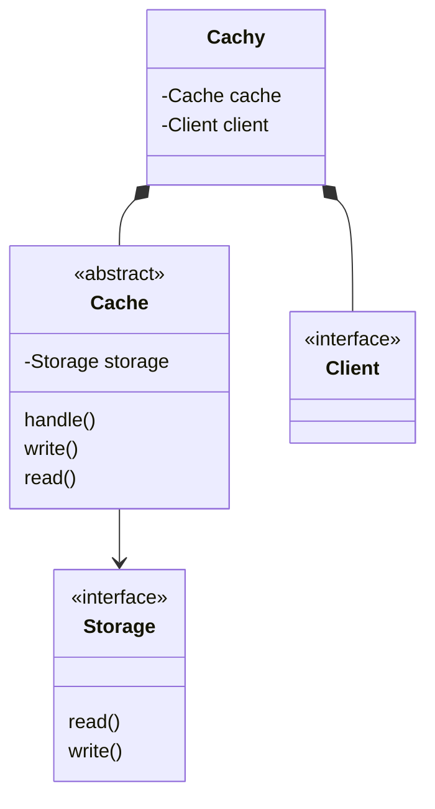

# cachy

Cachy adds a caching layer to your javascript clients. 
It is designed to add your own storages (plain objects, local storage and more), clients (like axios, fetch and more) and caching strategies. 

# Tutorial

Code can be found in `public`.

Let´s assume following project:
We want to create a simple app where we can fetch github user data. 
As we just want to fetch some basic data that won´t change very fast, 
we want to cache the results in a very simple way.


As a result we want following things

- caching `get` calls 
- storing response in local storage
- after performing a request it should get stored for 60 seconds. After that time the response should be renewed
- using `window.fetch` 

`Cachy` doesn´t provide that requirements out of the box (there will be implemtations in the future for storage, caching and co.) but the library 
provides useful interfaces, classes and methods that will help you to create it by your own. Plus: you can change caching strategies and storage later without rewriting everything. 

Following the requirements we need to do:

- creating our `Client` class that redirects requests between `Cachy` and `window.fetch`
- creating our `Cache` class that handles the caching logic
- creating our `Storage` class that will store responses into the local storage
- setup up `Cachy`


### Creating our client

As mentioned before we want to use `window.fetch`. Therefore we need a class that implements the interface `Client`.
Let´s create our class `FetchClient` in file `public/fetch-client.ts`.

``` typescript
import { Client } from '../lib';

class FetchClient implements Client {
    
};

export default FetchClient;
```


For now we get a typescript error because we didnt implement the `request` method yet.
This method will get the `Request` object as an argument and should return a promise. 
So lets create our request method. In our simple app we just need the `method` and the `url`. 
In other cases when we need to pass data as a request-body or request-header we need `data`. 

``` typescript
import { Client, Request } from '../lib';

class FetchClient implements Client {
    async request(requestData: Request): Promise<any> {
        if (requestData.method === 'get') {
            const response = await fetch(requestData.url);
            const data = await response.json();
            return data;
        }
    }
};

export default FetchClient;
```

### Creating our storage

Our storage interface is quite simple. 
We need to create a class that implements a `read` and `write` method. 
Both methods become `id: Id` and `item: CacheItem` as an argument.
Let´s create our class.

``` typescript 
import { Storage, CacheItem } from "../lib";

class LocalStorage implements Storage {
    async read({ id }: { id: string }): Promise<any> {
        const result = localStorage.getItem(id);

        if (result === null) {
            return false;
        }

        return JSON.parse(result);

    };
    async write({ id, item }: { id: string; item: CacheItem; }): Promise<boolean> {
        try {
            localStorage.setItem(id, JSON.stringify(item))
            return true;
        } catch (error) {
            console.error(error);
            return false;
        }
    }
};

export default LocalStorage;
```

### Creating our cache handler

Last but no least we need to create our caching class. 
In this class we need to implement our caching logic. 
For our example we want to check if there is an excisting cache item with the correct request id 
and them look if that request is older then seconds. 

Therefore we need to dynamical add infos to our reqest object. 
`Request.info` is the place where you can write and read data for those cases.

``` typescript 
import { Cache, CacheItem, Request } from '../lib';
import { Response } from '../lib/types.d';

class TimeCache extends Cache {
    constructor({ storage}) {
        super({ storage });
    }

    async handle({ id, request, response }: { id: string, request: Request, response: Response }): Promise<any> {
        // response will be passed if 
        if (response) {
            const currentTimestamp = Date.now();

            // inject timestamp into request object
            request.info = {
                lastUpdate: currentTimestamp,
            };

            const item = new CacheItem({
                request,
                response,
            });

            await this.write({ id, item });
            return item;
        }

        const item = await this.read({ id });
        const noItemInCache = item === false;

        if (noItemInCache) {
            return false;
        }

        const lastUpdate = item.request.info.lastUpdate;
        const currentTimestamp = Date.now();

        const shouldRefreshRequest = (currentTimestamp - lastUpdate) > 60 * 1000;

        if (shouldRefreshRequest) {
            return false;
        }

        return item;
    }
}

export default TimeCache;
```

### Setup Cachy and dom interaction

``` typescript
import { Cachy } from '../lib';
import FetchClient from './fetch-client';
import LocalStorage from './local-storage'; 
import TimeCache from './time-cache';

const url = (username: string) => `https://api.github.com/users/${username}`;

const storage = new LocalStorage();
const cache = new TimeCache({ storage });
const client = new FetchClient();

const apiClient = new Cachy({
    cache,
    client,
});


const elements = {
    bio: document.querySelector('.user-info__bio'),
    location: document.querySelector('.user-info__location'),
    input: document.querySelector('.user-form__input'),
    button: document.querySelector('.user-form__button')
};

elements.button.addEventListener('click', async () => {
    const result = await apiClient.request({ url: url(elements.input.value), method: 'get' });
    elements.bio.textContent = result.response.bio;
    elements.location.textContent = result.response.location;
});
```

HTML code is in the `public/index.html`. 
When you enter a github username we fetch the data from github api. 
As you can see in the network panel: 
After the first request, every following click will get the result from cache. 
Afer 60 seconds it will refetch the data from the api. 

# API

# Implementations

# Design


